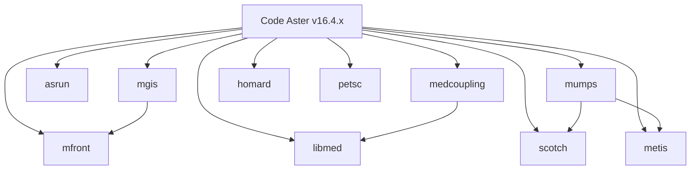

# Compiling Code Aster for Conda

## Introduction
Once the number of failed tests reaches a low enough number, and the remaining failures can be attributed to
either missing dependencies that are excluded on purpose or to identified errors related to version-mismatches, 
the conda package will be submitted to conda-forge.

The official code-aster variants published in Singularity containers are compiled against the following
dependencies v16.4.2: [VERSION="20221225"](#version20221225)


At the time of writing the code-aster conda package is compiled for python 3.9, 3.10 and 3.11. 

To download and install the conda package run the following command:

`mamba create -n codeaster -c krande/label/gcc8 code-aster==16.4.2`

Here are the latest test results for the different experimental packages:

| Label | Python version | Failed Tests | Status                                                                                        |
|-------|----------------|--------------|-----------------------------------------------------------------------------------------------|
| gcc8  | 3.9            | 118          | [CI Status](https://github.com/Krande/condapackaging/actions/runs/5976400546/job/16223638863) |
| gcc8  | 3.10           | 121          | [CI Status](https://github.com/Krande/condapackaging/actions/runs/5976400546/job/16223639052) |
| gcc8  | 3.11           | 26           | [CI Status](https://github.com/Krande/condapackaging/actions/runs/5976400546/job/16223639163) |


Note!

Among the reported failing tests, 10 tests are currently failing on all python versions and are a direct result of 
missing dependencies (ie 10 tests are not considered critical wrt. validating code aster as a conda package).

The dependencies in question are
* scipy (1)
* xmgrace (6)
* miss3d (1)
* asrun (2)

*Regarding the tests failing on python 3.10 and 3.9*

There seems to be an issue with importing cmath on python 3.10 and 3.9. 
Ie. there are a lot of new floating point errors in the tests not present for python 3.11, that when backtraced with
gdb points to `/usr/local/src/conda/python-3.10.8/Modules/cmathmodule.c: No such file or directory.`.

So a test was made by adding `import cmath` to the top of the AUTO_IMPORT list in `lib/aster/run_aster/command_files.py` 
and rerunning the floating point issue-related tests (ie. tests not failing for python 3.11), 
the total number of failed tests are reduced by 88 (for both python 3.9 and 3.10).

* Python 3.10 is reduced from 121 -> 33.
* Python 3.9 is reduced from 118 -> 30

## Methodology
For now github actions is the chosen tools for quickly developing, packaging and testing code-aster for conda.

The intention is to set up the official compilation of code-aster and its dependencies in conda-forge. 
To emulate as close as possible the conditions found in conda-forge the conda_build_config.yaml file 
will contain more information based on the global pinning file used by conda-forge. 
See https://github.com/conda-forge/conda-forge-pinning-feedstock/blob/main/recipe/conda_build_config.yaml
for more information.

## Dependencies relations
The following graphs shows the different relationships between the different packages.

First is the simplest sequential variant:



Then for the MPI variant and the related packages, the graph looks like this:

````mermaid

flowchart TD;
  
  classDef mpi fill:#f00,stroke:#333,stroke-width:2px;
  classDef nompi fill:#008000,stroke:#333,stroke-width:2px;
  classDef both fill:#00f,stroke:#333,stroke-width:2px;

  subgraph "No-MPI"
    C[libmed]
    F[asrun]
    I[mgis]
    G[metis]
    B[mfront]
    J[homard]
  end

  subgraph "MPI-only"   
    L[parmetis]
    K[petsc]
  end
  
  subgraph "Both"
    D[scotch]
    H[mumps]
    E[medcoupling]
  end

  A[Code Aster v16.4.x]
  
  A --> B
  A --> C
  A --> D
  A --> E
  A --> F
  A --> G
  A --> H
  A --> I
  A --> J
  A --> K
  A --> L
  
  I --> B
  H --> G
  H --> D
  E --> C
  E --> K
  K --> L
  K --> D
  K --> H

  %% MPI Nodes
  class K,L mpi;
  
  %% NOMPI Nodes
  class B,C,F,I,J,G nompi;

  %% Both MPI and NOMPI
  class D,H,E both;


````

## Validation

**NOTE!** Keep in mind that many of the tests require `ctest`. So you will have to install `cmake` if you haven't 
already

`run_ctest --resutest=temp/ctest -L submit -L sequential -LE need_data --timefactor=5.0 --only-failed-results -j 6`

### Debugging individual failed tests

When selected a failed test to investigated further, go to the $CONDA_PREFIX/share/aster/tests directory
and find and copy the `<test_name>.export` and `<test_name>.comm` files and include all files mentioned in the 
`<test_name>.export` file. 

Ensure that you have gdb installed, `ulimit -c unlimited` and turned of Apport (if you're on ubuntu) 
`sudo service apport stop`. Then do the following:


`python3 -m run_aster.run_aster_main ssnp162p.export --test --gdb`

or 

`gdb -ex r --args python3 -m run_aster.run_aster_main zzzz328d.export`

or 

`gdb -ex 'b dyna_vibra.py:44' --args python3 -m run_aster.run_aster_main ahlv302g.export`
(I haven't been able to get this to work yet, but it should be possible to set a breakpoint in the python code)


### Comparing results with results from github actions. 

In order to compare apple's with apple's its important to know which default packages are installed in the
github actions environment. This can be found in the following link:
https://github.com/actions/runner-images/blob/main/images/linux/Ubuntu2204-Readme.md

## Compilation Status

### Linux

The current status of the conda package compilation is as follows:

**Sequential**

- [x] Code Aster v16.4.2
- [x] mfront
- [x] libmed
- [x] scotch
- [x] medcoupling
- [x] asrun
- [x] metis
- [x] mumps
- [x] mgis
- [x] homard

**MPI**
In order of dependency 

- [x] permetis
- [x] scotch
- [ ] mumps
- [ ] medcoupling
- [ ] petsc


#### Compatibility with conda-forge packages

Note! The following modifications are necessary on the source code of the dependencies:
(https://gitlab.com/codeaster/src/-/issues/1#note_1520809038)

* metis/parmetis: allow to define the type of integers.
* Mumps: install headers with explicit integers size actually used.
* PETSc: our branch just embeds some tgz to avoid issues with network access:

```3rd/SuperLU_v5.3.0.tar.gz
3rd/hpddm_b9ae0dc6cf88af52b1572b990f8b1731cabceaaf.tar.gz
3rd/hypre_v2.24.0.tar.gz
3rd/pkg-trilinos-ml-v13.2.0.tar.gz
3rd/slepc-aa5f86854e5d457ce6ff5041b1c308588ba71c25.tar.gz
3rd/sowing_v1.1.26-p4.tar.gz
```
* mfront
  * 
* scotch
  * 
* HDF5 v1.10.6 (conda-forge) vs v1.10.9 (custom)
  * No observable difference in number of failed tests when comparing v1.10.6 and v1.10.9 

### Windows

- [ ] Code Aster v16.4.2
- [ ] mfront
- [ ] libmed
- [ ] scotch
- [ ] medcoupling
- [ ] asrun
- [ ] metis
- [ ] mumps
- [ ] mgis
- [ ] homard
- [ ] petsc

### OSX

not started


## Official deps

* [v15.8.0 Singularity env](https://gitlab.com/codeaster/src/-/blob/15.8.0/env.d/scibian9_std.sh?ref_type=tags)
* v16.4.2: [VERSION="20221225"](#version20221225)

### VERSION="20221225"
Can be downloaded from https://www.code-aster.org/FICHIERS/prerequisites/codeaster-prerequisites-20221225-oss.tar.gz
```
VERSION="20221225"

HDF5="1.10.9"
MED="4.1.1"
METIS="5.1.0_aster4"
PARMETIS="4.0.3_aster3"
MFRONT="4.1.0" # prefix 'TFEL-' added in build script
# MFRONT_SHA=""
MGIS="2.1-dev" # prefix 'MFrontGenericInterfaceSupport-' added in build script
MGIS_SHA="995ea8d"
HOMARD="11.12_aster2"
SCOTCH="7.0.1" # prefix 'v' added in build script
SCALAPACK="2.1.0"
MUMPS="5.5.1_consortium_aster1"
MUMPS_GPL="5.5.1_aster1"
PETSC="3.17.1_aster"
_HPDDM="b9ae0dc6cf88af52b1572b990f8b1731cabceaaf"
_HYPRE="v2.24.0"
_ML="v13.2.0"
_SOWING="v1.1.26-p4"
_SPLEC="aa5f86854e5d457ce6ff5041b1c308588ba71c25"
_SUPERLU="v5.3.0"
MISS3D="6.7_aster7"
MPI4PY="3.1.3"
MEDCOUPLING="V9_10_0"
_CONFIGURATION="V9_10_0"
ECREVISSE="3.2.2"
ECREVISSE_GPL="None"
GMSH="4.10.5-Linux64"
GRACE="0.0.1"
ASRUN="2021.0.0-1"
```
# General tips

## Why sysroot 2.17
Basically to enable centos 7 support. See the following links for more information:
# https://conda-forge.org/docs/maintainer/knowledge_base.html#using-centos-7

## Enable Core Dumps 
First, make sure that core dumps are enabled on your system. 
You can check the current limit by running the command `ulimit -c`. 
If the value is 0, core dumps are disabled. You can enable them by running `ulimit -c unlimited`

If you're on ubuntu you might have to turn off `Apport` before running the compilation. 
Do this by entering `sudo service apport stop` (after you're done debugging you can turn 
it back off `sudo service apport start`).

## Sysroot and cross compilation
Could this be relevant?
https://docs.conda.io/projects/conda-build/en/latest/resources/compiler-tools.html#an-aside-on-cmake-and-sysroots

If this is the case it would affect the following packages:

* [mgis](./mgis/build.sh)
* [mfront](./mfront/build.sh)
* [medcoupling](./medcoupling/build.sh)